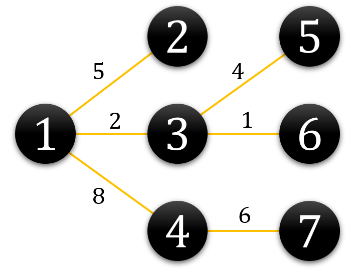
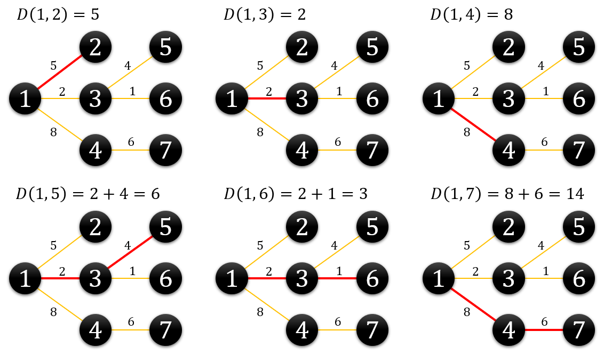

# 거리*합*구하기

Solved at: 2026-04-07 (자력 솔브 실패)

Rerouting Tree DP

  
<strong>문제</strong>

현호는 사내 네트워크 분석 업무를 담당하게 되었다. 현재 사내 네트워크는 $N$개의 노드를 가지는 트리 형태의 네트워크인데, 이 말은 두 노드 간의 연결이 정확히 $N-1$개 있어서 이 연결만으로 모든 노드 간에 통신을 할 수 있다는 뜻이다.

각 노드에 1에서 $N$ 사이의 번호를 붙이면 $i$번째 연결은 $x_i$번 노드와 $y_i$번 노드를 양방향으로 연결하며, 통신에 걸리는 시간은 $t_i$이다. $dist(i, j)$는 $i$번 노드에서 여러 연결을 거쳐 $j$번 노드에 도달하기 위해 걸리는 최소 시간이다. 노드를 들를 때 추가적인 작업이 없는 이상적인 시간을 따진다.

현호는 네트워크 분석을 위해 어떤 노드를 기준으로 다른 모든 노드 사이와의 거리의 합을 알고 싶다. 즉, 모든 노드 $i$에 대하여 다음 값을 구하고자 한다.

$$\sum_{j=1}^{N} dist(i, j)$$

예를 들어 다음과 같이 7개의 노드로 이루어진 네트워크가 있다고 하자. 각 연결 위에 적힌 수는 $t$를 나타낸다.

1번 노드를 기준으로 거리의 합을 구해보면 다음과 같다.

<strong>입력</strong>

첫째 줄에 노드의 개수 $N$이 주어진다.
다음 $N-1$줄의 $i$번째 줄에는 $i$번째 연결을 나타내는 세 정수 $x_i, y_i, t_i$가 주어진다.

- $1 \le N \le 2 \times 10^5$
- 주어진 $N-1$개의 연결로 모든 노드가 연결되어 있다.
- $1 \le x_i, y_i \le N$
- $1 \le t_i \le 10^6$

<strong>출력</strong>

$N$개의 줄에 걸쳐서, $i$번째 줄에는 $i$번 노드와 다른 모든 노드 사이의 거리의 합을 출력한다.

<strong>서브태스크</strong>

| 번호 | 배점 | 제한                   |
| :--- | :--- | :--------------------- |
| 1    | 10   | $N \le 2 \times 10^3$  |
| 2    | 90   | 다른 제약 조건이 없다. |

## Solution

### 1. 초기 DFS ($O(N)$)

임의의 노드(예: 1번)를 루트로 설정하여 트리를 순회하며 다음 두 가지를 전처리합니다.

- **$sz[u]$**: 노드 $u$를 루트로 하는 서브트리의 노드 개수
- **$f(1)$**: 1번 노드에서 다른 모든 노드까지의 거리 합 ($\sum_{i=1}^{N} dist(1, i)$)

### 2. Rerouting DP ($O(N)$)

부모 노드 $u$에서 자식 노드 $v$로 루트를 옮길 때(이동하는 간선의 가중치 $w$), 거리의 변화량은 다음과 같습니다.

- $v$ 쪽 서브트리에 속한 $sz[v]$개의 노드들은 $w$만큼 **가까워집니다.**
- $v$ 쪽이 아닌 나머지 $N - sz[v]$개의 노드들은 $w$만큼 **멀어집니다.**

따라서 다음과 같은 점화식이 성립합니다.

$$f(v) = f(u) - (w \times sz[v]) + (w \times (N - sz[v]))$$

이를 정리하면 코드로 구현하기 가장 편한 형태가 됩니다.

$$f(v) = f(u) + w \times (N - 2 \times sz[v])$$
