# 안전운전을 도와줄 차세대 지능형 교통시스템

Solved at: 2026-04-14 (1h 20m)

상태공간 탐색.

1. 신호는 특정한 방향에서 들어오는 것만 허용.

2. 신호의 경우 Modulo 4와 같이 들어오는 방향의 규칙이 있음.

3. 따라서 각 $t$에 $N \times N \times 4$ 만큼의 후보군을 탐색하며
   이동이 가능하면 `visited` 배열과 `nxt`배열에 넣으면 된다.

4. 이때 `nxt` 배열에는 방향까지 같이 넣어준다.

 
  
<strong>문제</strong>

자율주행차가 영화 속 자율주행차와 다른 이유는 차량 자체의 센서 기술은 발달했지만, 교통 인프라는 도입되지 않았기 때문이다. 이 때, 필요한 것이 바로 차세대 지능형 교통 시스템이다. 통상 ITS는 지능형 교통시스템(Intelligent Transport System)을 이야기 한다.

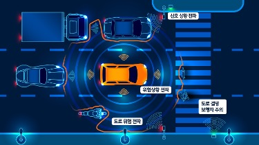

ITS는 이미 우리의 삶에 밀접하게 연결되어 있다. 내비게이션 실시간 교통정보, 고속도로의 하이패스, 정류장의 버스 도착 안내 시스템들이 ITS에 속한다. 여기서 차량과 인프라가 서로 협력하면 차세대 지능형 교통시스템(C-ITS, Cooperative Intelligent Transportation System)이 되는 것이다. 이렇게 차량 주행과 관련된 인프라와 차량 등이 통신하기 시작하면 사고나 정체 상황에서 놀라운 일이 벌어진다.

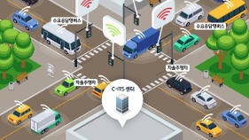

여기 교통 인프라(신호등)와 실시간 통신을 하는 자율주행 자동차가 $N$ 크기(가로: $N$, 세로: $N$)도로를 지나고 있다. 격자 간 연결된 선을 도로, 각 선(도로)의 교차점들을 교차로로 생각하자. 자율주행 자동차는 처음에 제일 왼쪽 위의 교차로로 아래쪽 방향에서 진입하고 있다. (자동차는 격자의 한 칸을 가는 데는 1분이 걸린다.)

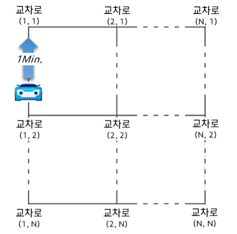

각 교차로의 신호등은 다음과 같은 12가지 상태 중 4가지를 가지고 무한히 반복하는 방식으로 운영된다.

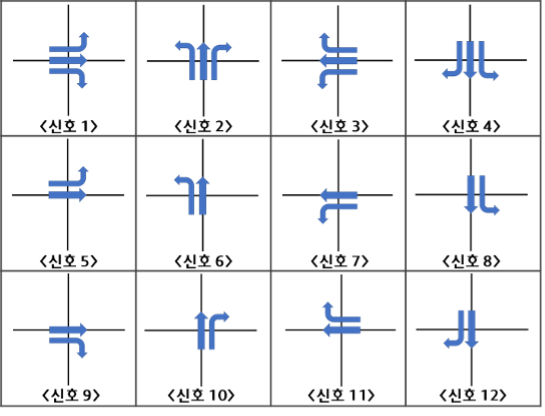

자율주행 자동차가 멈추지 않고, 시간 $T$(분) 이내에 갈 수 있는 교차로의 수를 계산하라. 단, 신호가 맞지 않으면 그 교차로에는 갈 수가 없다. 처음에 제일 왼쪽 위의 교차로로 아래쪽 방향에서 진입하고 있으므로, 교차로(1,1)의 신호가 2, 6, 10번 중 하나가 아니면 갈 수 있는 교차로가 단 하나 교차로(1,1)로 계산한다.

  
<strong>입력</strong>

입력으로는 격자의 크기 $N$과 시간 $T$(분)가 첫 줄에 주어진다. $(1 \le N, T \le 100)$

다음 $N^2$개의 줄에 각 교차로의 신호 집합이 주어진다. 신호는 항상 4개이다.
예를 들어 신호 집합이 <3 2 6 10>과 같이 주어진 경우는 아래와 같다.

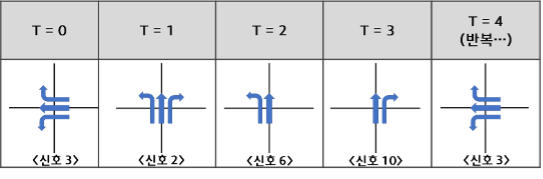

  
<strong>출력</strong>

이동 경로에 있는 모든 교차로의 개수를 출력한다. 한번 갔던 교차로는 중복해서 세지 않는다.

  
<strong>서브태스크</strong>

| 번호 | 배점 | 제한                 |
| ---- | ---- | -------------------- |
| 1    | 10   | $1 \le N, T \le 5$   |
| 2    | 90   | 추가 제약 조건 없음. |

  
<strong>노트</strong>

예시 입력의 경우 다음과 같이 정답을 계산할 수 있다.

[T=0] 자율주행 자동차는 처음에 제일 왼쪽 위의 교차로로 아래쪽 방향에서 진입하고 있고, 그 때 교차로 A의 신호등은 2번이므로 우회전만 가능하다.
(이동 경로에 있는 교차로 1개 – 교차로 A)

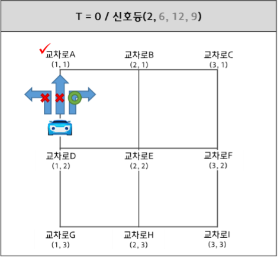

[T=1] 교차로 B로 진입하고 있고, 그 때 교차로 B의 신호등은 1번이므로 직진과 우회전이 가능하다. (이동 경로에 있는 교차로 2개 – 교차로 A, 교차로 B)

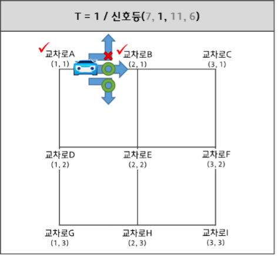

[T=2, case 1] 교차로 B를 통과해서 갈 수 있는 두가지 경로(교차로 C, 교차로 E 向) 중, 교차로 C로 진입을 하게 될 때 교차로 C의 신호등은 5번으로 직진과 좌회전 신호이지만 더 이상의 진행은 불가능 하다. (이동 경로에 있는 교차로 3개 – 교차로 A, 교차로 B, 교차로 C)

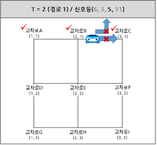

[T=2, case 2] 교차로 B를 통과해서 갈 수 있는 두가지 경로(교차로 C, 교차로 E 向) 중, 교차로 E로 진입을 하게 될 때 교차로 E의 신호등은 8번으로 직진과 좌회전이 가능하다. (이동 경로에 있는 교차로 3개 – 교차로 A, 교차로 B, 교차로 E)

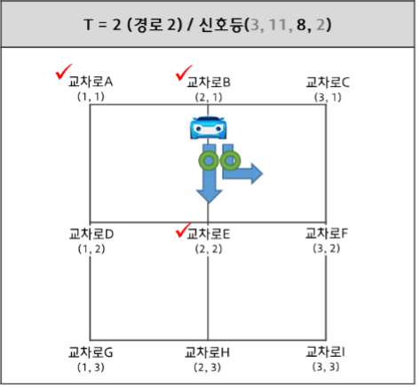

[T=3, case 2-1] 교차로 E를 통과해서 갈 수 있는 두가지 경로(교차로 F, 교차로 H 向) 중, 교차로 F로 진입을 하게 될 때 교차로 F의 신호등은 9번으로 직진과 우회전이나 우회전만 가능하다. (이동 경로에 있는 교차로 4개 – 교차로 A, 교차로 B, 교차로 E, 교차로 F)

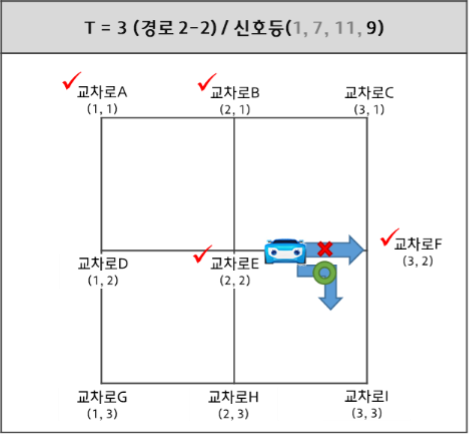

[T=3, case 2-2] 교차로 E를 통과해서 갈 수 있는 두가지 경로(교차로 F, 교차로 H 向) 중, 교차로 H로 진입을 하게 될 때 교차로 H의 신호등은 4번으로 직진과 좌회전, 우회전이나 좌회전과 우회전만 가능하다. (이동 경로에 있는 교차로 4개 – 교차로 A, 교차로 B, 교차로 E, 교차로 H)

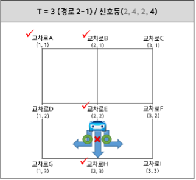

그래서 T=0~3까지 모든 시간동안 이동경로에 있는 모든 교차로는 총 6개 이다. (교차로 A, 교차로 B, 교차로 C, 교차로 E, 교차로 F, 교차로 H)

