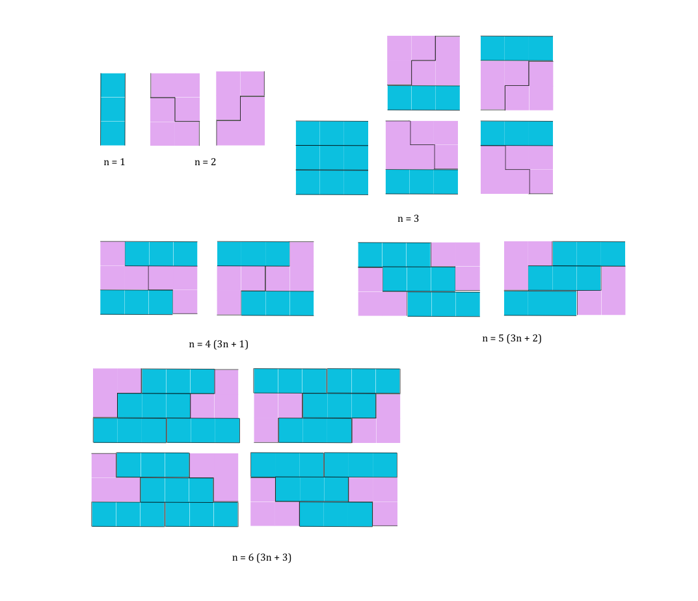

# 아방가르드 타일링

Solved at: 2026-01-11 (30)

https://school.programmers.co.kr/learn/courses/30/lessons/181186

DP

### All possible cases:



$3n + k$ tiling can be always be expanded by inserting three $1 \times 3$ tiles.

Moreover, they are unique.

### DP Setting

$$
\begin{aligned}
dp[i] =\;& dp[i - 1] + 2 \cdot dp[i - 2] + 5 \cdot dp[i - 3] \\
        &+ 2 \cdot dp[i - 4] + 2 \cdot dp[i - 5] + 4 \cdot dp[i - 6] \\
        &+ 2 \cdot dp[i - 7] + 2 \cdot dp[i - 8] + 4 \cdot dp[i - 9] \\
        &+ \cdots
\end{aligned}
$$

where `dp[i]` is a number of ways a $3 \times i$ grid can be completely filled.

### optimization

Instead of $O(n^2)$ dp, we can simplify the equation as such:

$$
\begin{aligned}
dp[i] = & 1 \cdot dp[i - 1] + 2 \cdot dp[i - 2] + 5 \cdot dp[i - 3] \\
        &+ 2 \times \sum_{\substack{k \in [0, i - 4] \\ 1 \equiv i - k \pmod{3}}} dp[k]\\
        &+ 2 \times \sum_{\substack{k \in [0, i - 4] \\ 2 \equiv i - k \pmod{3}}} dp[k]\\
        &+ 4 \times \sum_{\substack{k \in [0, i - 4] \\ 0 \equiv i - k \pmod{3}}} dp[k]
\end{aligned}
$$

This sum part is pre-processed in a such way.

```
    memo[i] = memo[i - 1] * 1 + memo[i - 2] * 2 + memo[i - 3] * 5;
    memo[i] += sum[(i + 2) % 3] * 2 + sum[(i + 1) % 3] * 2 + sum[i % 3] * 4;

    sum[(i - 3) % 3] += memo[i - 3];
```
