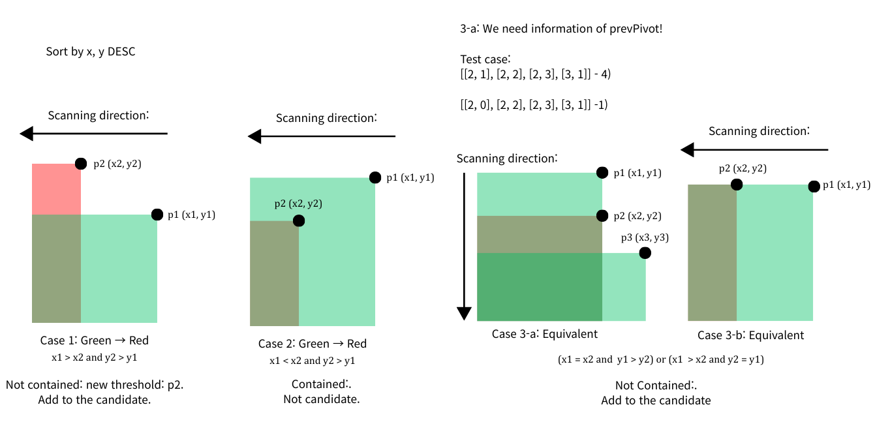
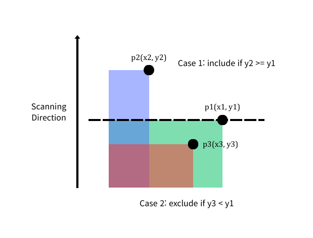

# 인사고과

Solved at: 2026-01-10, 2026-01-11 (90m - failed / 5m)

https://school.programmers.co.kr/learn/courses/30/lessons/152995

[Pareto Frontier](https://en.wikipedia.org/wiki/Pareto_front)

## First attempt

By setting the criteria as x DESC and y DESC, we have such cases.

[code1](main.cpp)

## Second attempt

By setting the criteria as x DESC and y **ASC**, the cases become significantly
less.

[code2](better.cpp)
