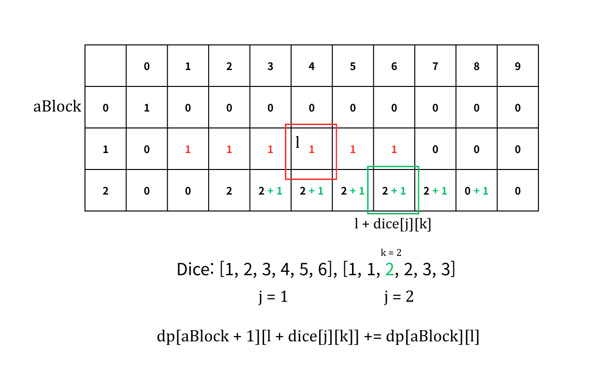

# 주사위 고르기

Solved at: 2026-01-06 (30m)

https://school.programmers.co.kr/learn/courses/30/lessons/258709

## Overall Procdeure

1. Pick the dice set of A.

2. Create `aSum/bSum[i][j]` that refers to:

`i`: index of individual dice.

`j`: sum of the dice

`aSum[i][j]`: number of dice combinations that can make up this result.

3. Get the cumulative/prefix sum for B, and solve for the answer.

### Picking the Dice Set

Bitmasking is used.

```
for (int i = 0; i < (1 << n); i++) {
    if (cntIndices(i) != n / 2)
      continue;
```

In this, cntIndices can be replaced with `__builtin_popcount(x)` instead.

### Creating `aSum, bSum`

DP was used.

`aSum[aBlock + 1][l + dice[j][k]] += aSum[aBlock][l];`



After this operation, `aSum, bSum[n/2][k]` contains number of combinations
possible with value `k`.

### Optional prefix sum

Since we have to deal with sum of all bSum less than current A,

```
// cumulative sum
for (int j = 1; j <= 500; j++) {
  bSum[bBlock][j] += bSum[bBlock][j - 1];
}
```

cumulative sum was used.

### Answer building

Now, since we know that `bSum[n/2][k]` contains number of combinations of b with
from 0 ~ k,

Calculation can be easily done by

`aSum[aBlock][j] * bSum[bBlock][j - 1]`.
