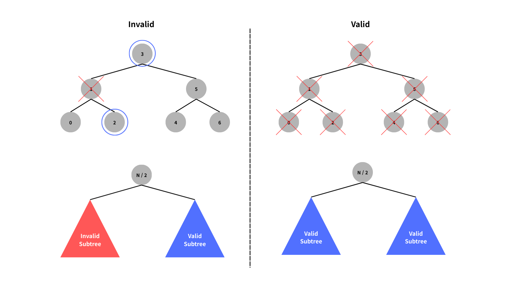

# 표현 가능한 이진트리

Solved at: 2026-01-13 (30m)

https://school.programmers.co.kr/learn/courses/30/lessons/150367

Tree Representation

### Number to Tree

It is guaranteed that the tree is in a form of [Perfect Binary Tree](https://www.geeksforgeeks.org/dsa/complete-binary-tree/).

So the tree length can be determined within this sequence: `1, 3, 7, 15, 31, ...`

```
  // check for the string digits
  while (num > ((1ll << limit) - 1)) {
    limit = limit * 2 + 1;
  }
```

### Determining Tree Validity

In this tree representation, the root node is in the center, so we can recursively find
its subtrees.

ex) root node of string length `15` is always at index `7`.

After the root node is determined the tree is **valid** if,

1. Tree with size 1 is always valid.

2. Root is `0` and **all** the elements are `0`.

3. Root is `1` and both of its subtrees are valid.


